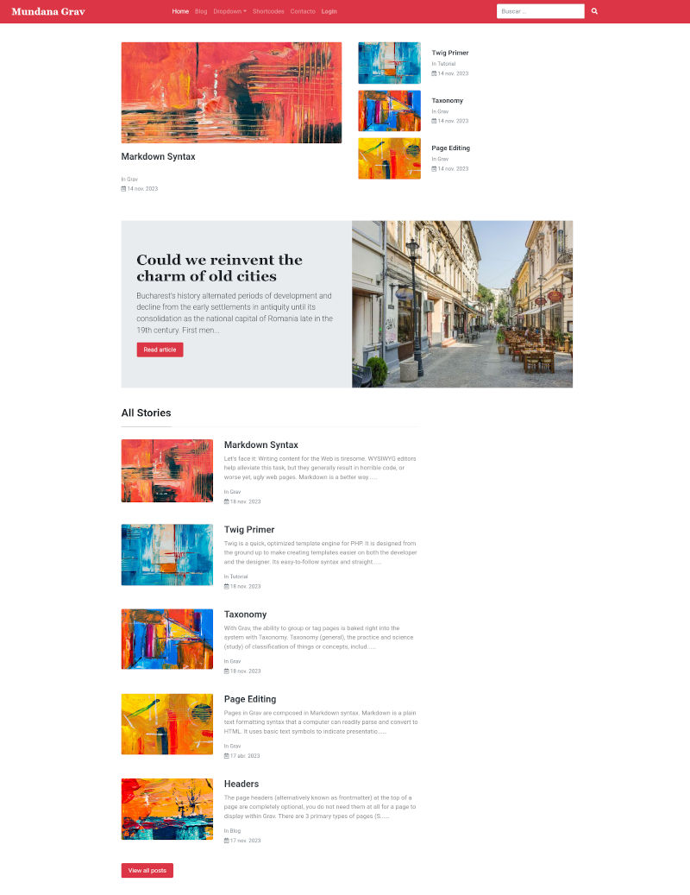
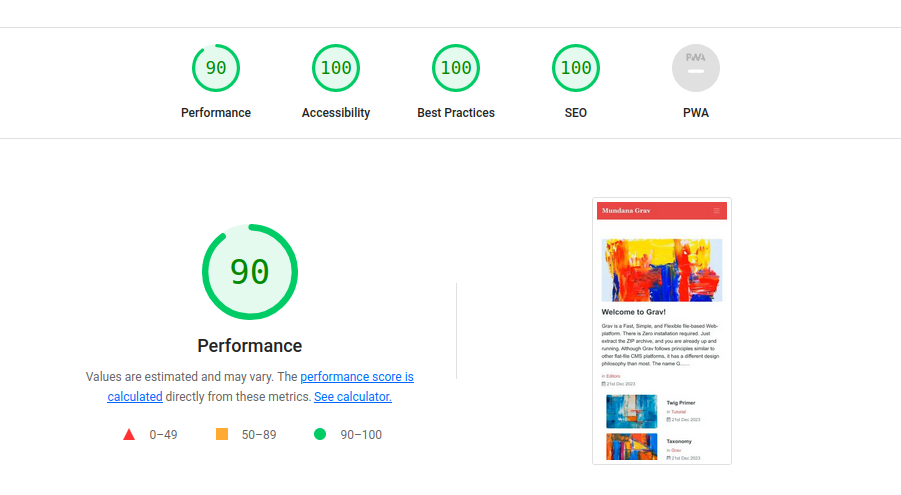

# Mundana Theme for Grav CMS

Mundana theme by Wowthemes ported to Grav.

Mundana theme by Wowthemes, features a clean, minimalistic design, styling for all basic page elements and HTML5/CSS3 code designed for quick and easy customization. Beautifully crafted, Mundana is the perfect design for your Grav blog. Homepage, search, post article and category layouts available.



**If you enjoy this theme, please consider sponsoring:**

<a href="https://www.buymeacoffee.com/birdydesign" target="_blank"></a>

## Installation

Installing the Mundana theme can be done in one of two ways. Our GPM (Grav Package Manager) installation method enables you to quickly and easily install the theme with a simple terminal command, while the manual method enables you to do so via a zip file.

### GPM Installation (Preferred)

The simplest way to install this theme is via the [Grav Package Manager (GPM)](http://learn.getgrav.org/advanced/grav-gpm) through your system's Terminal (also called the command line).  From the root of your Grav install type:

    bin/gpm install mundana

This will install the Mundana theme into your `/user/themes` directory within Grav. Its files can be found under `/your/site/grav/user/themes/mundana`.

### Manual Installation

To install this theme, just download the zip version of this repository and unzip it under `/your/site/grav/user/themes`. Then, rename the folder to `mundana`. You can find these files on [GitHub](https://github.com/pmoreno-rodriguez/grav-theme-mundana) or via [GetGrav.org](http://getgrav.org/downloads/themes).

### Post Installation

Enable the **Mundana** theme, either via the Admin plugin at admin/themes or in the system.yaml file under pages.theme.
```
pages:
  theme: mundana
```

Do not directly edit the mundana.yaml file found in the theme folder. Copy the mundana.yaml file to user/config/themes and edit the new file there.

## Features

- Featured Posts on Homepage
- Pagination
- Post Sharing
- Categories
- Prev/Next Links
- Disqus Comments
- Mailchimp Integration
- Contact Form Ready
- Design Features:
    * Bootstrap v4.6
    * Font Awesome 5
- HTML5 and CSS3
- Fully Responsive
- Various templates for presenting your content
- Full dropdown menu integrated in menu bar and sidebar.
- Styling for all basic page elements
- Styling for various modules
- Fully responsive with full-page mobile navigation
- SCSS based CSS source files for easy customization
- Shortcodes to write your pages easily, taking advantage of the styles offered by the theme.
- Custom styles for Login forms. 
- Support for navigation menu on one-page websites.
- Demo Data
- Translation Ready
- Seo Friendly
- Optimized for speed & performance



## Supported Page Templates

- Default template
- Error template
- Blog template
- Post template
- Contact template
- SimpleSearch template
- Support for taxonomylist, related pages, random, feeds and archives plugins.
- Modular view templates:
    - All Stories template
    - Latest posts template
    - Sticky post template

## Featured Posts

The posts tagged with the selected tag in the theme settings and the chosen number (up to a maximum of 5), will be automatically displayed in a mini-list in the sidebar.

## Blog Pages

* Add a blog page if you need it in your web. 
* Item template is ready to work the Reading Time plugin. 
* Breadcumbs plugin activated by default in posts.
* Added option to filter by author taxonomy. It is necessary to configure the author taxonomy, in the site configuration, so that the authors of the blog pages appear in them and you can use the filters by author that the theme has.
* Social sharing icons added to blog items
* Support for date translation if using the translate-date or twig-extensions plugins.

## Default Options

Mundana comes with a few default options that can be set site-wide.  These options are:

```yaml
dropdown.enabled:               # Enable/Disable dropdown menu in navbar
production-mode:                # In production mode, only minified CSS is used. When disabled, nested CSS are enabled
back_to_top_button:             # Enable/Disable back to top button
favicon:                        # Choosse your own favicon
custom_logo_enabled:            # Enable/Disable custom logo in navbar
custom_logo_width:              # Set custom width for custom logo (values between 20 to 300 pixels)
custom_logo:                    # A custom logo rather than the default (see below)  
custom_logo_mobile:             # A custom logo to use for mobile navigation
custom_css:                     # Load custom css from theme://assets/css/custom.css if available
custom_js:                      # Load custom js from theme://assets/css/custom.js if available
menu_langswitcher:              # Enable/Disable langswitcher icon in menu (langswitcher plugin needed)
menu_search:                    # Enable/Disable search icon in navbar (simplesearch plugin needed)
menu_login:                     # Enable/Disable login icon in menu
override_page_style:            # If enabled, all defined page styles will be overridden
default_page_style:             # If override_page_style is enable, you can choose the default page style
navbar.container_fluid:         # Use .container-fluid in navbar, for a full width container
navbar.height:                  # Set custom height for navbar (values between 35 to 150)
navbar.display_site_name:       # Display site name in navbar
navbar.icon:                    # Display icon in navbar from Fontawesome (only if custom_log is disabled)
navbar.icon_group:              # Choose the icon group (fas, fab or fa)
navbar.icon_size:               # Set icon size (xs, sm or lg)
navbar.style:                   # Set the navbar style (light or dark)
navbar.bgcolor:                 # Set background color (available in Bootstrap)
navbar.custom_bgcolor:          # Set a custom background color if you don't want to set any of those available in Bootstrap
custommenus.enabled:            # Enable/Disable custom menus in top menu
custom_menu_items:              # List of custom items for the menu
sidebar_showtaxonomy:           # Enable/Disable the popular tags section in sidebar (taxonomylist plugin is required)
sidebar_showarchives:           # Enable/Disable the archives section in sidebar (archives plugin is required)
sidebar_showrelatedpages:       # Enable/Disable the related pages section in sidebar (relatedpages plugin is required)
sidebar_showfeeds:              # Enable/Disable the feeds section in sidebar (feeds plugin is required)
sidebar_showrandom:             # Enable/Disable the random section in sidebar (random plugin is required)
blog-route: '/blog'             # The route to the blog listing page, useful for a blog style layout
featuredposts:                  # Enable/Disable featured posts in left sidebar
featuredposts_category:         # Select category name for featured posts (configured in taxonomies)
featuredposts_number:           # The number of featured posts will be displayed on the left sidebar
share_enable:                   # Enable/Disable the social icons on blog posts
share_icons:                    # List of your social icons
mailchimp_enable:               # Enable/Disable the mailchimp box
mailchimp_address:              # Set the Mailchimp address
disqus_enable:                  # Enable/Disable the Disqus comments
disqus_name:                    # Set the short name for Disqus
footer_text_left:               # Custom text to be displayed in the left footer
footer_text_right:              # Custom text to be displayed in the right footer
```
To make modifications, you can copy the `user/themes/mundana/mundana.yaml` file to `user/config/themes/` folder and modify, or you can use the admin plugin.

> NOTE: Do not modify the `user/themes/mundana/mundana.yaml` file directly or your changes will be lost with any updates

## Custom Logos

To add a custom logo, you should put the log into the `user/themes/mundana/images/logo` folder.  Standard image formats are support (`.png`,`.jpg`, `.gif`, `.svg`, etc.).  Then reference the logo via the YAML like so:

```yaml
custom_logo:
    - name: 'my-custom-logo.png'
custom_logo_mobile:
    - name: 'my-custom-mobile-logo.png'    
```
Alternatively, you can you use the drag-n-drop "Custom Logo" field in the Mundana theme options.

## Shortcodes

To view details of Mundana theme shortcodes visit this link: [Mundana theme shortcodes](https://pmoreno-rodriguez.github.io/#/./gravthemes/mundana/index?id=shortcodes)

You can view some examples of shortcodes in the demo page.

## Demo page

[https://mundana.pmdesign.dev/](https://mundana.pmdesign.dev/)

## Documentation 

You can read extra documentation of Mundana Theme at [https://pmoreno-rodriguez.github.io/#/./gravthemes/mundana/index](https://pmoreno-rodriguez.github.io/#/./gravthemes/mundana/index)

## Future plans

* Future plans here

## Credits

* Thanks to Sal, from [WowThemes.net](https://www.wowthemes.net/) for develop the Jekyll theme.
